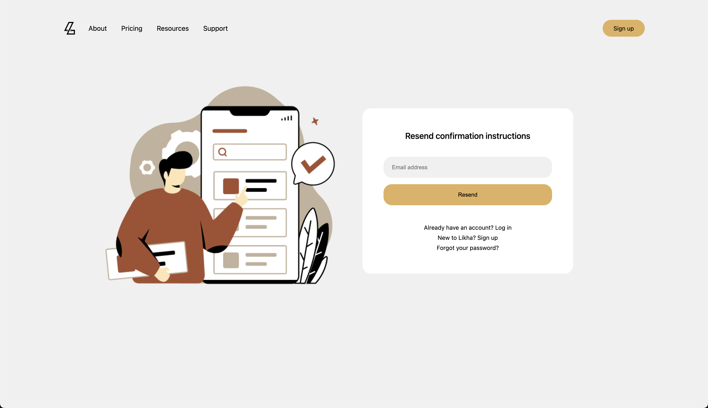
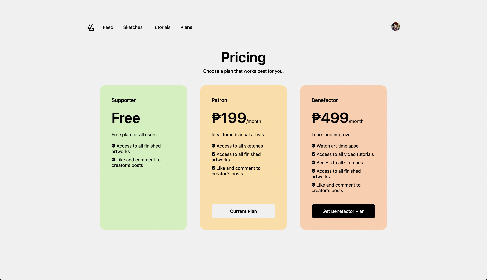
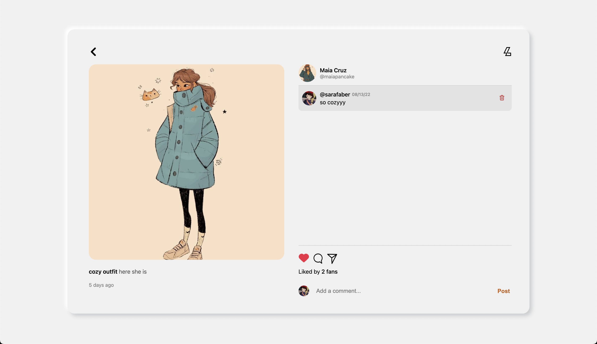

### ✨ [Likha (Click to see live version)](http://maia-on-likha.herokuapp.com)

>> ###### *A Ruby on Rails application that allows a user to subscribe for a certain creative content.*
>> - Utilized scaffold to auto generate a set of model, views, and controller for posts table and create a full CRUD web interface.
>> - Enabled users to pay their subscription through the PayMongo API, with the calculation of their subscription expiration.
>> - Employed Devise OmniAuth so users can easily log in and sign up through their google accounts.
>> - Used Devise helper for user authentication to limit users’ access unless logged in.
>> - Installed RSpec gem for model and system testing.

>> ###### **Sign in as admin**
>> - Email address: maiawithlikha@gmail.com
>> - Password: 1234567890

>> ###### **Plan upgrade payment details**
>> - You may use any name and email address.
>> - Use any of the following test card numbers [here](https://developers.paymongo.com/docs/testing).
>> - Input any future date as expiration date and any 3 digits for CVC.

 

 

 

 

 

 

 

>> ###### Sources:
>> - Heartcombo's [Devise Tutorial](https://github.com/heartcombo/devise)
>> - Paymongo API [Documentation](https://developers.paymongo.com/docs)
>> - Ruby on Rails's [Guides](https://guides.rubyonrails.org/v6.1/)
>> - [RSpec Rails Gem](https://github.com/rspec/rspec-rails) for testing.
>> - Artworks by [Magdalina Dianova](https://www.instagram.com/magdalina.dianova/)
>> - Images from [Canva](https://www.canva.com).